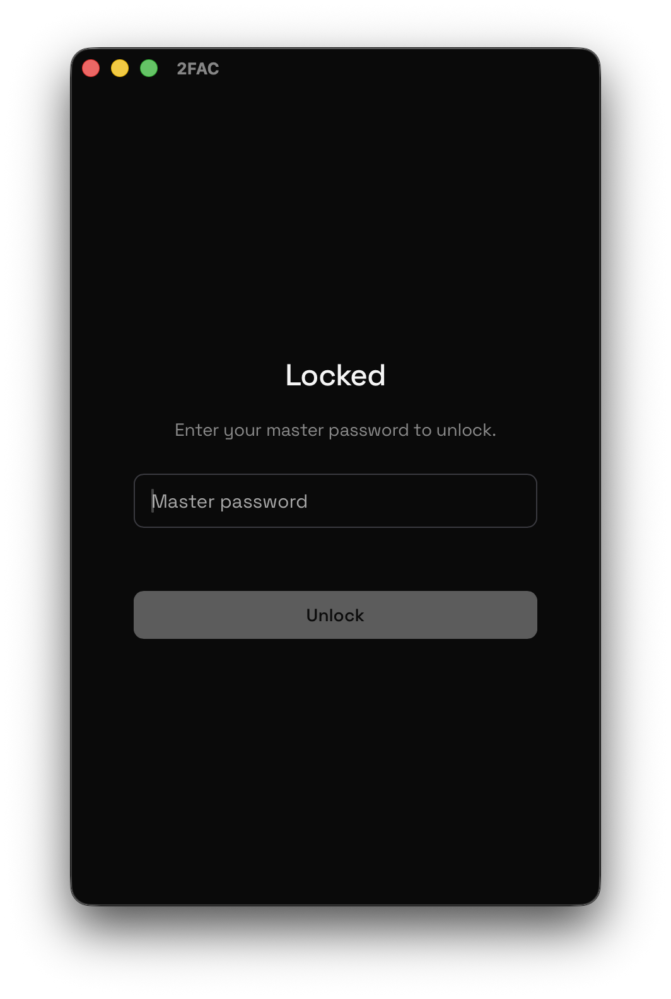
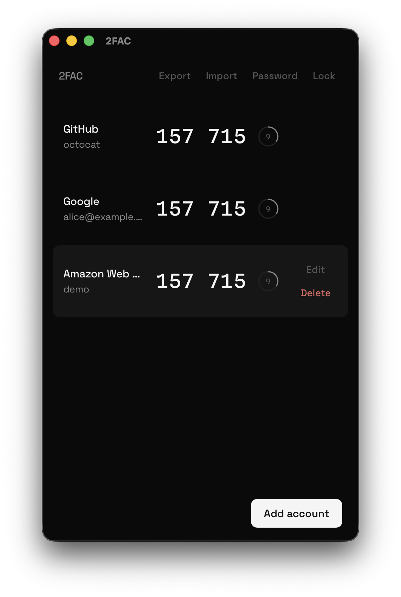
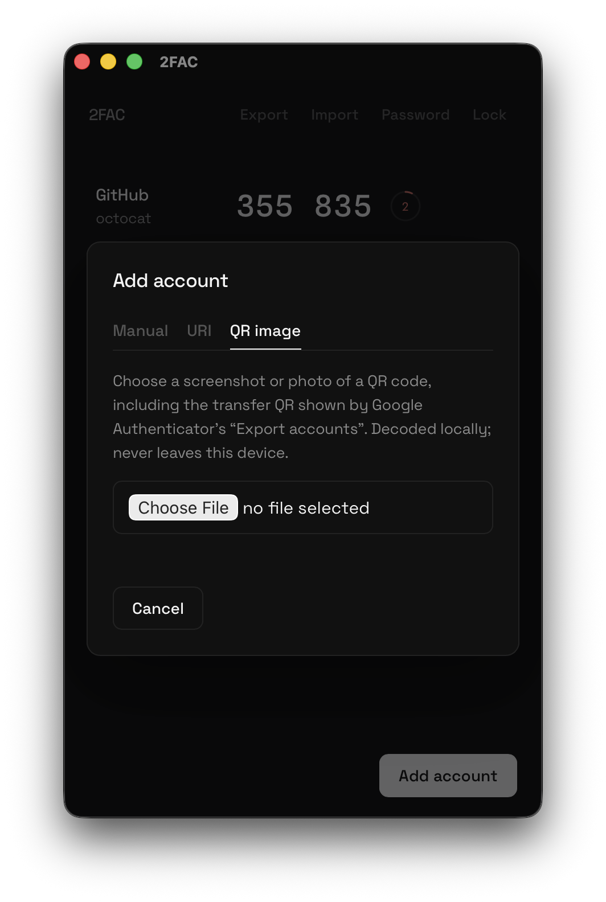

<div align="center">

# 2FAC

[](https://github.com/jeonjw85/2FAC/actions/workflows/ci.yml)
[](https://github.com/jeonjw85/2FAC/releases/latest)





</div>

[English](README.md)

데스크톱용 로컬 우선 TOTP 인증기입니다. 비밀키는 이 기기를 떠나지 않습니다.

Vault는 Argon2id와 AES-256-GCM으로 암호화됩니다. 코드는 Rust에서 계산하고, UI는 원본 시크릿을 보지 않습니다. 클라우드, 계정, 텔레메트리는 없습니다. 네트워크는 GitHub Releases의 서명된 업데이트 확인에만 씁니다.

UI 언어는 OS를 따릅니다 (영어 / 한국어).

## 설치

[Releases](https://github.com/jeonjw85/2FAC/releases)에서 빌드를 받습니다.

| macOS                         | Windows     | Linux                   |
| ----------------------------- | ----------- | ----------------------- |
| `.dmg` (Apple Silicon, Intel) | NSIS `.exe` | `.AppImage` 또는 `.deb` |

macOS 빌드는 ad-hoc 서명입니다 (Developer ID 아님, 공증 없음). Gatekeeper는 그대로 막습니다: 시스템 설정 → 개인정보 보호 및 보안 → 확인 후 열기. Windows·Linux는 미서명입니다. Windows는 처음 실행 시 SmartScreen이 경고할 수 있습니다.

앱 안 업데이트는 GitHub Releases의 minisign 서명을 검증합니다. Apple/Microsoft 코드 서명이 아닙니다.

같은 `kr.jjw.2fac` 앱 위에 새 빌드를 설치하면 Vault는 유지됩니다. Downloads에 받은 복사본을 따로 실행하지 마세요.

## 업데이트

실행 시 GitHub Releases를 확인합니다. 서명된 새 빌드가 있으면 물은 뒤, 현재 앱을 제자리 교체하고 다시 시작합니다. Vault는 디스크에 남습니다.

업데이트 확인은 draft가 아닌 공개 릴리스여야 합니다.

## 기능

- TOTP (RFC 6238): SHA-1 / SHA-256 / SHA-512, 자릿수·주기 설정
- 비밀키, `otpauth://` URI, QR 이미지 (파일 / 클립보드)로 추가
- 가져오기: 2FAC 암호화 백업, Aegis JSON, andOTP JSON, otpauth URI 목록, Google Authenticator 전송 QR (`otpauth-migration://`)
- 암호화 백업 내보내기 (같은 Vault 형식)
- 코드 복사 후 30초 뒤 클립보드 자동 삭제
- 자리비움 및 창을 닫으면 자동 잠금

## 빌드

Rust stable, pnpm, [Tauri v2 사전 요구사항](https://v2.tauri.app/start/prerequisites/)이 필요합니다.

```bash
pnpm install
pnpm lint
pnpm build
cd src-tauri && cargo test && cargo clippy --all-targets -- -D warnings
pnpm tauri build
```

## 라이선스

[GPL-3.0-only](LICENSE)
